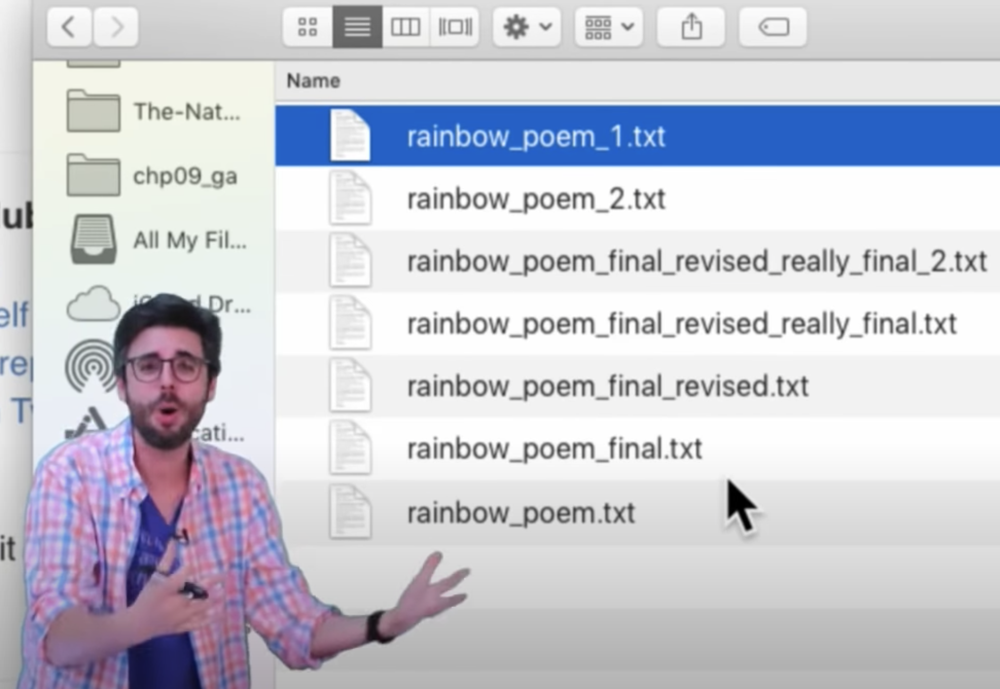

# GIT

Why GIT?
- Version control

- Collaboration
- Github vs GIT
- Repository
- Origin
- Clone
- Commit
- Push / Pull

- Branch
- Fetch

- Pull request

## Resources

[Basics of GIT](https://www.youtube.com/watch?v=0fKg7e37bQE)

[GITHUB](https://www.youtube.com/watch?v=w3jLJU7DT5E)

## Tasks

pre-course-project