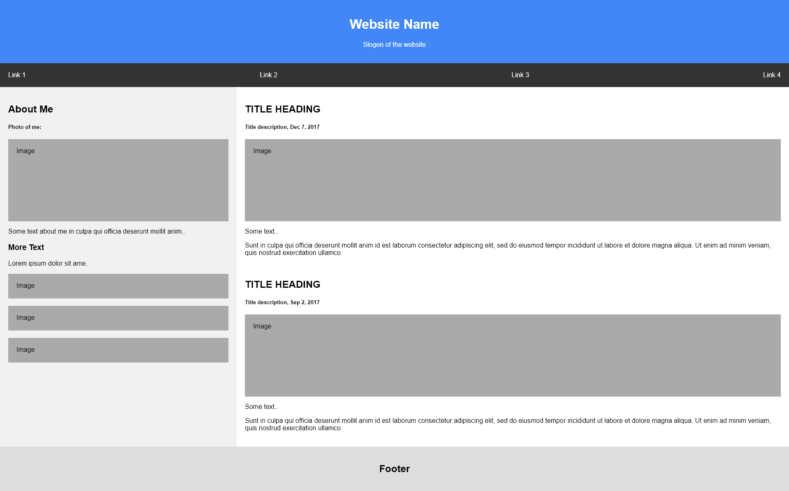

# Flex Box Task
- use flex box to create the expected results
https://css-tricks.com/snippets/css/a-guide-to-flexbox/

## Requirements 
- Create the same page expected result with flex boxes
- About me section is 30% of the width of the page
- Padding is 20px for:image text, footer text, about me section, articles section, link and website's name and slogan.
- use the following [website](https://html-color-codes.info/colors-from-image/) to find the colors to use.

## Expected state

